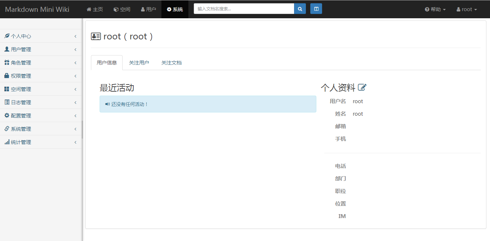
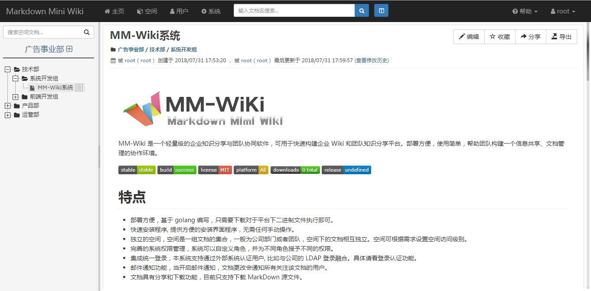
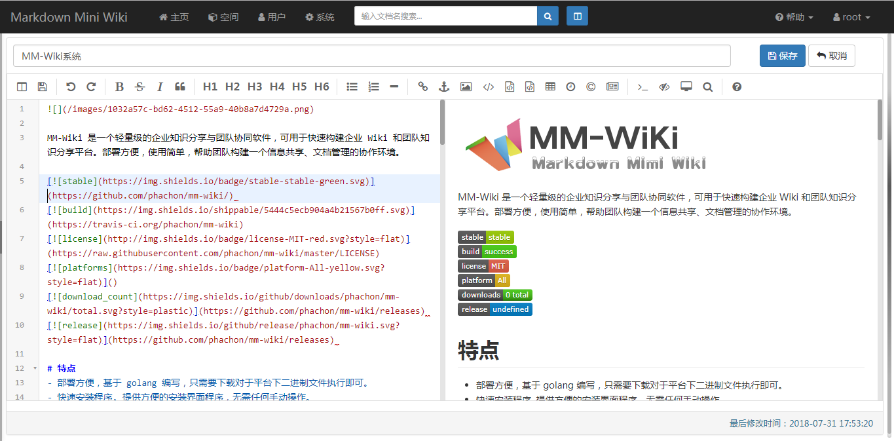
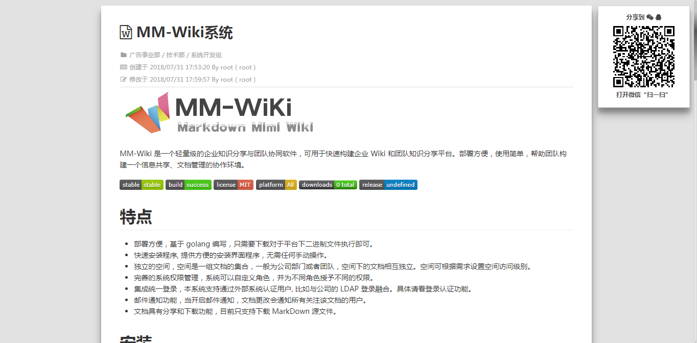

MM-Wiki is a light software that enables companies for internal knowledge sharing and for better collaboration. It serves as a platform for information sharing and wiki creating within as well as among teams.

[](https://github.com/phachon/mm-wiki/) 
[](https://travis-ci.org/phachon/mm-wiki)
[](https://raw.githubusercontent.com/phachon/mm-wiki/master/LICENSE)
[]()
[](https://github.com/phachon/mm-wiki/releases) 
[](https://github.com/phachon/mm-wiki/releases) 

# Features
- Easy deployment. It’s built with [Go](https://golang.org/doc/). You only need to download the package based on your system and execute the binary file.
- Quick installation. It has a clean and concise installing interface that guides you through the process. 
- Private space for each team and department. By setting permissions, other teams/departments can read, edit files.
- Flexible system administration setting. Each user has different roles with various aspects of permissions accordingly.
- This app allows users to log in through certified external system such as the company’s LDAP log in system.
- Stay synced with your team. You’ll receive email notifications when the file you're following is updated.
- Share and download the file. For now you can only download files in the form of Markdown plain text.
- Support full text search.

# Introduction
- [mm-wiki](http://wiki.cifaz.com/), userName:admin, password:mmwiki; If cannot click it, Copy the URL: http://wiki.cifaz.com/

# Installation
## Install by downloading it.
- Linux
  ```
    # Make a directory. 
    $ mkdir mm_wiki
    $ cd mm_wiki
    # Take linux amd64 as an example: download the latest release of the software.
    # Downloading address: https://github.com/phachon/mm-wiki/releases 
    # Unzip the file to the directory you just created.
    $ tar -zxvf mm-wiki-linux-amd64.tar.gz
    # Enter into the installation directory
    $ cd install
    # Execute the file. The default port is 8090. Set another port using: --port=8087
    $ ./install
    # Visit http://ip:8090 in a browser. Now you should see the installation interface. Follow the instruction to finish settings.
    # Ctrl + C to stop installation. Turn on MM-Wiki. 
    $ cd ..
    $ ./mm-wiki --conf conf/mm-wiki.conf
    # Now you can visit the ip address with the port the system is listening.
    # Enjoy using MM-wiki!
    ```
- Windows

    1.Take linux amd64 as an example: [download](https://github.com/phachon/mm-wiki/releases) the latest release of the software.<br />
    2.Unzip the file to a directory that you set before.<br />
    3.Click into the install directory.<br />
    4.Double click install.exe. <br />
    5.Visit http://ip:8090 in a browser and now you should see the installation interface. Follow instructions to finish installations.<br />
    6.Close the installation window.<br />
    7.Use command line（cmd.exe）to enter into the root directory.<br />
    `$ execute mm-wiki.exe --conf conf/mm-wiki.conf`<br />
    8.Now you can visit the ip address with the port the system is listening. Enjoy using MM-wiki!<br />
 
**Note**: If the there's 502 error in the browser when you should see the installation guide instead, change a browser and try it again.<br />
   

## Install with Nginx reverse proxy
```
upstream frontends {
    server 127.0.0.1:8088; # MM-Wiki listening ip:port
}
server {
    listen      80;
    server_name wiki.intra.xxxxx.com www.wiki.intra.xxxxx.com;
    location / {
        proxy_pass_header Server;
        proxy_set_header Host $http_host;
        proxy_redirect off;
        proxy_set_header X-Real-IP $remote_addr;
        proxy_set_header X-Scheme $scheme;
        proxy_pass http://frontends;
    }
    # static resources managed by nginx
    location /static {
        root        /www/mm-wiki; # MM-Wiki root directory
        expires     1d;
        add_header  Cache-Control public;
        access_log  off;
    }
}
```
# A quick look

### 1 Installing

### 2 Log in

### 3 The system

### 4 The interface

### 5 Files editing

### 6 Files sharing


# Plugins that are used in this app

MM-Wiki is built with many great plugins. Many thanks to developers of these plugins: 

- [bootstrap](https://github.com/twbs/bootstrap)
- [awesome-bootstrap-checkbox](https://github.com/flatlogic/awesome-bootstrap-checkbox)
- [bootstrap-iconpicker](https://victor-valencia.github.com/bootstrap-iconpicker)
- [bootstrap-select](http://silviomoreto.github.io/bootstrap-select)
- [bootstrap-switch](https://bttstrp.github.io/bootstrap-switch)
- [bootstrap-tagsinput](https://github.com/bootstrap-tagsinput/bootstrap-tagsinput)
- [editor.md](https://github.com/pandao/editor.md)
- [layout](http://jquery-dev.com)
- [layer](http://layer.layui.com/)
- [metisMenu](https://github.com/onokumus/metisMenu)
- [morris](http://morrisjs.github.com/morris.js/)
- [popover](https://github.com/sandywalker/webui-popover)
- [scrollup](http://markgoodyear.com/labs/scrollup/)
- [zTreev3](http://treejs.cn/)

# Contributing

Requirement：go 1.8
```
$ git clone https://github.com/phachon/mm-wiki.git
$ cd mm-wiki
$ go build ./
```

## Supporting
If you want to buy me a coffee :)

 


## Feedback
- Official QQ group number：853467682
- If you like this app, please [Star](https://github.com/phachon/mm-wiki/stargazers) it.
- If there're issues while you're using it, submit a [issue](https://github.com/phachon/mm-wiki/issues).
- If you find a bug and solve it, make a [pull request](https://github.com/phachon/mm-wiki/pulls).
- If you want to contribute to it, please [fork](https://github.com/phachon/mm-wiki/network/members) it.
- If you want to make friends with me,shoot me an email at [phachon@163.com](mailto:phachon@163.com).

## License

MIT

Many thanks!
---

Created By [phachon](https://github.com/phachon)
